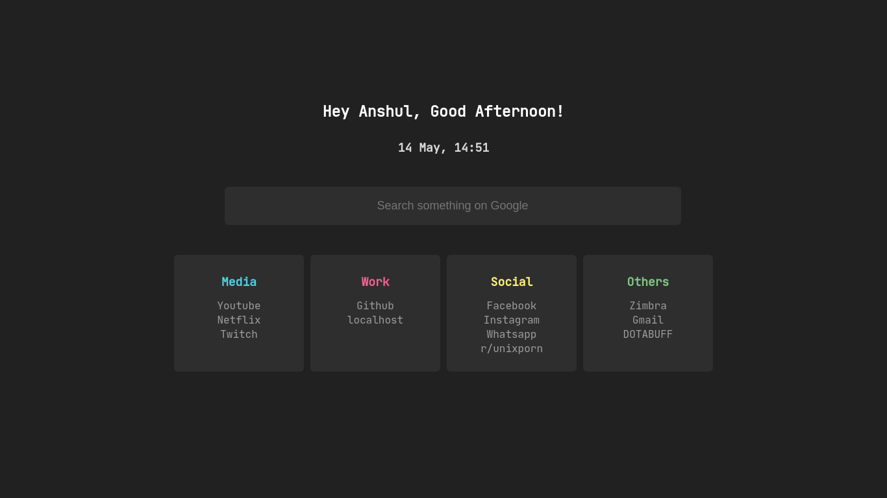

# Chrome Startpage
Minimal aesthetic startpage for chrome



## How to Use

- Clone the repo

    ```console
    git clone https://github.com/koshyari/chrome-startpage.git
    ```
- On chrome, open extensions from the tool menu or open it from [chrome://extensions](chrome://extensions).

- Click on load unpacked, navigate to the directory where you cloned the repo and select it.

## Settings

Edit the ```config.json``` file present in the root directory of the repo and then install the extension by following the above steps.
